# 📔 PoC Process Journal: BDK Electrum Streaming

- **Dev:** Rafael Turon  
- **Project:** Implement a new module in bdk-electrum that uses electrum-streaming-client 
- **Context:** Implementing a streaming client module for `bdk-electrum` to enable non-blocking, real-time blockchain subscriptions. This bridges the gap between my bare-metal wallet studies and production-grade async networking.

---

## Resources & References
- [BDK Documentation](https://docs.rs/bdk/latest/bdk/)
- [Electrum Protocol Specs](https://electrumx.readthedocs.io/en/latest/protocol-methods.html)
- [electrum-client crate](https://crates.io/crates/electrum-client)
- [Tokio Async Book](https://tokio.rs/tokio/tutorial)

---

## 📅 2026-01-04 | Day 01: Setup, Strategy & The Big Picture

### Repository Strategy
I initiated this public repository (`bdk-electrum-streaming-poc`) to work on the Bitcoin Dev Launchpad PoC.
To respect the course rules regarding the privacy of past assignments, I decided to keep my legacy bare-metal wallet code in a separate **private repository** (`rust-bitcoin-wallet-evolution`). This allows me to work here with full transparency on the new BDK integration without leaking solutions to previous educational challenges.

### The Big Picture: Custody Agents
While this PoC focuses on BDK and Electrum, it serves as a critical engineering milestone for my venture, **Custody Agents**. My ultimate goal is to transition from bare-metal learning to shipping a production-grade **Cosigner via Nostr**.

**The Vision:**
I am architecting a mechanism that uses decentralized Nostr relays to facilitate encrypted, asynchronous communication of **Partially Signed Bitcoin Transactions (PSBTs)** between co-signers.
* **Protocol:** Leveraging **Nostr Connect (NIP-46)** to create a Nostr Remote Signer.
* **Resilience:** A serverless architecture that eliminates the "Single Point of Failure" inherent in centralized APIs.
* **Uptime:** Ensuring 24/7 operational availability via redundant relay channels for critical transaction signing.

**The Connection:**
Mastering **Async Rust** and **Streaming Architectures** in this PoC (via Electrum) is the direct prerequisite for implementing the event-driven subscription model required by Nostr relays.

### The AI Protocol
I established strict rules for using AI tools during this project to maximize my learning:
1.  **Core Logic (Rust):** Strict **No-AI** policy. All async networking and BDK integration logic will be hand-written to ensure I deeply understand the `tokio` runtime and protocol details needed for the robust architecture described above.
2.  **Documentation & Journal:** I will use AI to assist with English drafting and clarity to ensure this journal is professional and easy to read.
3.  **Boilerplate:** AI is allowed for repetitive tasks (e.g., CI configs, gitignore).

### Technical Kickoff
I'm analyzing the current `bdk_electrum` implementation. It currently relies on **polling** for balance updates, which is inefficient and unsuited for the real-time responsiveness required by a remote signer.
- **The Goal:** Implement a streaming client using the Electrum `blockchain.scripthash.subscribe` method.
- **The Challenge:** Bridging the gap between a long-running async stream (receiving notifications) and the BDK wallet's update mechanism.
- **Sequence Diagram:** An asynchronous 'Push' architecture where a buffered channel acts as a shock absorber, decoupling the high-speed network stream from the local wallet state.

```mermaid
sequenceDiagram
    participant User as 👤 User
    participant Wallet as 🧠 bdk_wallet
    participant Adapter as 🌉 Adapter (cache)
    participant Channel as 📬 MPSC Channel
    participant Stream as ⚡ Streaming Client
    participant Server as ☁️ Electrum Server

    Note over Wallet, Server: Phase 1: Setup (The Handshake)
    Wallet->>Adapter: Initialize
    Adapter->>Channel: Create Channel
    Adapter->>Stream: Connect & Subscribe
    Stream->>Server: blockchain.scripthash.subscribe
    Server-->>Stream: OK (Subscription Active)

    Note over Stream, Server: Phase 2: The Producer (Network)
    par Bitcoin Network
        Server->>Server: 💰 New Transaction!
        Server->>Stream: 🔔 Notification (Push)
        Stream->>Channel: send(Event)
        Note right of Channel: Buffers in Queue
    end

    Note over Adapter, Channel: Phase 3: The Consumer (Background)
    loop Continuous Processing
        Channel-->>Adapter: recv()
        Adapter->>Adapter: Updates Local Cache
    end

    Note over User, Wallet: Phase 4: Reading (Instant)
    User->>Wallet: sync()
    Wallet->>Adapter: Query Balance
    Adapter-->>Wallet: Responds from Memory
```


### Next Steps
- [x] Initialize the project with `bdk` electrum command line application using its tools:
   * Core: `bdk_wallet` (Logic), `bdk_chain` (Structures).
   * Persistence: `bdk_file_store` (To test persistence across sessions).
   * Network: `bdk_electrum` (The standard client we will eventually wrap/replace).
- [x] Write a simple "Hello World" subscription test to validate the async concept.

---

## 📅 2026-01-05 | Day 02: Foundation, Discovery & Strategy

### Objective

My primary goal today is to establish a solid "AS-IS" baseline by building a standard CLI wallet using `bdk` components (v1.0) with the traditional polling method. This creates a **Control Group** to benchmark against.

However, the scope expanded significantly after a deep dive into the BDK ecosystem's history. I uncovered existing experimental work that validates my architectural thesis, shifting my strategy from "inventing from scratch" to "orchestrating and finishing."

### The "Gold Mine" Discovery: `bdk_electrum_streaming`

While researching implementation paths, I discovered an experimental repository by Core Dev **Evan Linjin** [(`bdk_electrum_streaming`)](https://github.com/evanlinjin/experiments/tree/main/bdk_electrum_streaming) that attempts to solve exactly what I am building.

**Key Strategic Insights:**

1. **Validation of Architecture:** The fact that a lead maintainer explored this confirms that **Streaming** is a critical, unsolved need in the BDK ecosystem.

2. **The "Hard Part" is Solved:** The repository contains the complex domain logic required to translate raw Electrum JSON notifications into `bdk_chain` updates.
* *My Strategy:* I will leverage this domain logic (the "math") but wrap it in my own architectural implementation.

3. **My Value Add (The Architect's Role):** While the experiment focuses on internal BDK mechanics, my contribution will be the **System Architecture**. I will implement a robust `tokio::mpsc` channel topology to decouple the high-speed network stream from the wallet state.

### The "Official Example" Strategy
I am adjusting my contribution goal to maximize success and community adoption:
* **The Risk:** Attempting a PR directly into the `bdk_electrum` core crate requires handling every edge case and supporting every async runtime (agnosticism), which is a high barrier to entry.
* **The Pivot:** I will aim to deliver this as a production-grade **"Official Example"** or a **"Satellite Crate"**.
* This allows me to be "opinionated" (enforcing `tokio` and `mpsc` for robustness).
* It provides immediate utility to the community (a "recipe" for high-frequency apps) without getting bogged down in low-level library politics.

### Technical Implementation Plan

#### 1. Project Initialization

I initialized the Rust binary project that will house both the control group and the future streaming implementation.

```bash
cd bdk-electrum-streaming-poc
cargo init
```

#### 2. Dependency Management

I configured `Cargo.toml` to support the modular BDK structure while laying the groundwork for the async implementation.

**Selected Crates:**

* **`bdk_wallet`**: The "Brain". Handles descriptors and UTXO calculation.
* **`bdk_electrum`**: The "Network".
* **`bdk_file_store`**: The "Memory". Essential for testing persistence.
* **`tokio`**: The "Engine". Even for the polling baseline, I am including the full `tokio` runtime to prepare for the transition to the `mpsc` streaming architecture.

```toml
[package]
name = "bdk-electrum-streaming-poc"
version = "0.1.0"
edition = "2024"

[dependencies]
bdk_wallet = { version = "1.0.0-beta.6", features = ["file_store"] } # Check for latest
bdk_electrum = "0.19.0"
bdk_file_store = "0.14.0"
bdk_chain = "0.16.0"
bitcoin = "0.32.2"
tokio = { version = "1", features = ["full"] }
clap = { version = "4", features = ["derive"] }
anyhow = "1.0"
dotenvy = "0.15"
log = "0.4"
env_logger = "0.11"

```

### Next Steps

* [x] Successfully compile and run the baseline wallet.
* [x] Send testnet coins to the generated address.
* [x] Confirm that `wallet_db.dat` grows and persists the transaction history.
* [x] **Day 03 Goal:** Create the separate `networking` module and implement the `StreamingClient` struct.

---

## 📅 2026-01-08 | Day 03: The Control Group & Performance Baseline

### Objective

Today's mission was to execute the "Control Group" plan defined on Day 02. Before writing a single line of async streaming code, I needed a working, persisted BDK wallet using the standard blocking approach.

Crucially, I added **instrumentation** to this baseline. To scientifically prove the value of the future `tokio::mpsc` architecture, I need hard data on how long the current "stop-and-wait" polling mechanism takes from the user's perspective.

### Implementation & Execution

#### 1. The "AS-IS" Implementation (`main.rs`)

I finalized the `main.rs` implementation. To keep the benchmark clean, I encapsulated the polling logic into a dedicated function `run_baseline_sync`. This allows me to isolate the network/processing time from the startup time.

```rust
// Snippet from main.rs

// 1. Setup Phase (One-off cost)
let wallet = setup_wallet(&args.descriptor, &args.network, &mut db)?;
let client = BdkElectrumClient::new(ElectrumClient::new(&args.electrum_url)?);

println!("Starting Sync (Polling)...");

// 2. The Benchmark Execution
// I wrapped the blocking calls in a specific function to measure the "Polling Tax"
let (duration, balance) = run_baseline_sync(&wallet, &client)?;

println!("Sync Completed in: {:.2?}", duration);
println!("Balance: {} sats", balance);

// ---

/// The "Control Group" Logic
/// This function simulates the user manually refreshing the wallet.
fn run_baseline_sync(
    wallet: &PersistedWallet, 
    client: &BdkElectrumClient
) -> anyhow::Result<(Duration, Amount)> {
    
    let start_time = std::time::Instant::now();

    // Step A: Build the Sync Request (The "Ask")
    let request = wallet.start_full_scan().build();

    // Step B: Blocking Network Call (The Bottleneck)
    // This blocks the thread until the Electrum server responds with full history
    let update = client.full_scan(request, 20, true)?;

    // Step C: Apply & Persist (State Reconciliation)
    wallet.apply_update(update)?;
    let db_change_set = wallet.commit()?;
    // db.append_changeset(&db_change_set)?; // Assumed global or passed DB

    Ok((start_time.elapsed(), wallet.get_balance().total()))
}

```

#### 2. Live Testing & Funding

I successfully compiled the project and ran it against the Bitcoin Testnet.

* **Compilation:** `cargo run --release` (Clean build).
* **Address Generation:** Generated a new external address `tb1q...`.
* **Funding:** Sent 50,000 sats from a Testnet Faucet.

#### 3. Persistence Validation

I verified that `bdk_file_store` is correctly saving the state. This is critical because the future streaming adapter must also feed this same persistence engine to ensure data safety.

* **Initial Run:** `wallet_db.dat` created (Size: ~12KB).
* **After Funding:** File size grew (Size: ~14KB) containing the transaction data.
* **Restart:** Rerunning the app loaded the balance *instantly* before the network sync, proving the `ChangeSet` was applied and saved correctly.

### The Baseline Metrics (Instrumentation)

I ran the sync process 5 times to get an average "Feel" of the latency.

| Run # | Action | Duration | Observation |
| --- | --- | --- | --- |
| 1 | Full Scan (Fresh) | **4.2s** | Noticeable freeze. |
| 2 | Incremental Sync | **1.8s** | Faster, but still blocking. |
| 3 | No Updates | **1.5s** | The "cost of asking" even when nothing changed. |


### Reflections

The "Control Group" is live. I now have a functional wallet that:

1. Connects to Electrum.
2. Persists data.
3. **Measurably lags** due to the blocking architecture.

This validates the business case for the Streaming implementation. My goal for the next phase is to reduce that "Notification Latency" from ~1.5s (polling interval + RTT) to near-instant (push), without blocking the main thread.

### Next Steps

* [ ] Create the new `networking` module structure.
* [ ] Implement the `StreamingClient` struct using `tokio::net::TcpStream`.
* [ ] Establish the "Handshake" (connect & SSL) without BDK logic first, just to validate the raw stream.


---
## 📅 2026-01-10 | Day 04: Real-World Sync Costs, Network Friction & The UX Tax

### Objective

Today’s goal was to move from a theoretical baseline to a real-world, adversarial network baseline:

* Measure how a real BDK wallet behaves on a cold start against public Electrum infrastructure, with a real descriptor, real gap scanning, and real persistence.
* This was not about code anymore. This was about **systems behavior**.

### Environment & Setup

I switched from toy test setups to:

* Real descriptor exported from Sparrow
* BIP84 testnet wallet
* Public Electrum servers:
* testnet4 (mempool.space)
* testnet3 (blockstream.info)


* Real persistence via `bdk_file_store`

**Command used (final, working):**

```bash
RUST_LOG=bdk_electrum=info,bdk_wallet=info cargo run -- \
  --network testnet \
  --electrum-url "ssl://electrum.blockstream.info:60002" \
  --descriptor "wpkh([73c5da0a/84h/1h/0h]tpubDC8msFGeGuwnKG9Upg7DM2b4DaRqg3CUZa5g8v2SRQ6K4NSkxUgd7HsL2XVWbVm39yBA4LAxysQAm397zwQSQoQgewGiYZqrA9DsP4zbQ1M/0/*)" \
  --change-descriptor "wpkh([73c5da0a/84h/1h/0h]tpubDC8msFGeGuwnKG9Upg7DM2b4DaRqg3CUZa5g8v2SRQ6K4NSkxUgd7HsL2XVWbVm39yBA4LAxysQAm397zwQSQoQgewGiYZqrA9DsP4zbQ1M/1/*)"

```

### First Shock: The System Looks Frozen (But Isn’t)

On the first run, the program appeared to hang for minutes:

```text
Setting up wallet...
Creating new wallet...
Connecting to Electrum...
Starting Progressive Sync Loop...
Sync round #1 ...

```

Then… nothing… for a long time.
This was not a bug. This was:
 **BDK doing a full historical gap-limit discovery scan over Electrum.**

### The Breakthrough: Measured Reality

After waiting patiently, the full run completed:

```text
Round #1 done in 114.85s
Round #2 done in 3.87s
Round #3 done in 3.84s
Round #4 done in 3.92s
Round #5 done in 3.83s
...
Total Time: 160.21s

```

### Interpretation: This Is the Real UX Tax

This single experiment revealed three critical truths:

**1. Cold start is brutally expensive**
**~115 seconds** just to discover used addresses.
This is not a BDK problem. This is:

* Gap limit scanning
* Over high-latency Electrum
* With many round trips
* On a public server

This is exactly what mobile wallets hide behind spinners.

**2. Warm sync is still not “fast”**
Even after discovery, every sync round still costs **~4 seconds**.
Why? Because I’m still calling `wallet.start_full_scan()`. So even though indexes are cached, we are still:

* Re-querying scripthashes
* Re-walking history
* Re-validating state

**3. Polling UX is fundamentally broken**
This is the key product insight:

> Even when nothing happens, the wallet must still pay ~4 seconds just to ask: **“Did something change?”**

That is the **Polling Tax**.

### Strategic Implication: Streaming Is Not a “Nice to Have”

This experiment proves the thesis:

> For good UX, wallets must not ask.
> They must be told.

### Architecture Validation

This directly validates the Day 01 design:
`Electrum Push → Streaming Client → mpsc Channel → Wallet Cache`

With streaming:

1. Full scan happens once (unavoidable)
2. After that:
* New block notifications = **instant**
* Mempool tx = **instant**
* UI reads from memory = **instant**
* **No polling**
* **No blocking**
* **No 4-second tax**

### Important Secondary Lessons

**Network Reality Is Messy**

* testnet4 infra is unstable / fragmented
* Some servers hang, some DNS names don’t resolve, some SSL handshakes stall.
* A production-grade wallet must support failover and multiple servers. This aligns perfectly with the Nostr relay mindset.

**Updated Mental Model**

* **Phase 1 (One-time):** `full_scan()` → expensive, unavoidable
* **Phase 2 (Forever):** `streaming push updates` → near zero latency

### Final Conclusion

Today I measured, in minutes and seconds, the exact UX pain that justifies the entire streaming architecture. This is no longer theoretical. It is proven by instrumentation.

### Next Steps

1. Split logic:
* First run → full_scan
* Subsequent runs → sync or streaming


2. Implement streaming Electrum client using:
* tokio
* Persistent TCP/TLS
* `blockchain.scripthash.subscribe`


3. Build the mpsc adapter layer between stream and wallet
4. Measure:
* Time-to-notification
* Time-to-balance-update
* Zero-polling UX


---

### Personal Note

This was the first time I felt the cost of protocol design in wall-clock time. This is exactly the kind of latency that destroys UX—and exactly the kind of problem good systems architecture eliminates.

---
