# 📔 PoC Process Journal: BDK Electrum Streaming

- **Dev:** Rafael Turon  
- **Project:** Implement a new module in bdk-electrum that uses electrum-streaming-client 
- **Context:** Implementing a streaming client module for `bdk-electrum` to enable non-blocking, real-time blockchain subscriptions. This bridges the gap between my bare-metal wallet studies and production-grade async networking.

---

## Resources & References
- [BDK Documentation](https://docs.rs/bdk/latest/bdk/)
- [Electrum Protocol Specs](https://electrumx.readthedocs.io/en/latest/protocol-methods.html)
- [electrum-client crate](https://crates.io/crates/electrum-client)
- [Tokio Async Book](https://tokio.rs/tokio/tutorial)

---

## 📅 2026-01-04 | Day 01: Setup, Strategy & The Big Picture

### Repository Strategy
I initiated this public repository (`bdk-electrum-streaming-poc`) to work on the Bitcoin Dev Launchpad PoC.
To respect the course rules regarding the privacy of past assignments, I decided to keep my legacy bare-metal wallet code in a separate **private repository** (`rust-bitcoin-wallet-evolution`). This allows me to work here with full transparency on the new BDK integration without leaking solutions to previous educational challenges.

### The Big Picture: Custody Agents
While this PoC focuses on BDK and Electrum, it serves as a critical engineering milestone for my venture, **Custody Agents**. My ultimate goal is to transition from bare-metal learning to shipping a production-grade **Cosigner via Nostr**.

**The Vision:**
I am architecting a mechanism that uses decentralized Nostr relays to facilitate encrypted, asynchronous communication of **Partially Signed Bitcoin Transactions (PSBTs)** between co-signers.
* **Protocol:** Leveraging **Nostr Connect (NIP-46)** to create a Nostr Remote Signer.
* **Resilience:** A serverless architecture that eliminates the "Single Point of Failure" inherent in centralized APIs.
* **Uptime:** Ensuring 24/7 operational availability via redundant relay channels for critical transaction signing.

**The Connection:**
Mastering **Async Rust** and **Streaming Architectures** in this PoC (via Electrum) is the direct prerequisite for implementing the event-driven subscription model required by Nostr relays.

### The AI Protocol
I established strict rules for using AI tools during this project to maximize my learning:
1.  **Core Logic (Rust):** Strict **No-AI** policy. All async networking and BDK integration logic will be hand-written to ensure I deeply understand the `tokio` runtime and protocol details needed for the robust architecture described above.
2.  **Documentation & Journal:** I will use AI to assist with English drafting and clarity to ensure this journal is professional and easy to read.
3.  **Boilerplate:** AI is allowed for repetitive tasks (e.g., CI configs, gitignore).

### Technical Kickoff
I'm analyzing the current `bdk_electrum` implementation. It currently relies on **polling** for balance updates, which is inefficient and unsuited for the real-time responsiveness required by a remote signer.
- **The Goal:** Implement a streaming client using the Electrum `blockchain.scripthash.subscribe` method.
- **The Challenge:** Bridging the gap between a long-running async stream (receiving notifications) and the BDK wallet's update mechanism.
- **Sequence Diagram:** An asynchronous 'Push' architecture where a buffered channel acts as a shock absorber, decoupling the high-speed network stream from the local wallet state.

```mermaid
sequenceDiagram
    participant User as 👤 User
    participant Wallet as 🧠 bdk_wallet
    participant Adapter as 🌉 Adapter (cache)
    participant Channel as 📬 MPSC Channel
    participant Stream as ⚡ Streaming Client
    participant Server as ☁️ Electrum Server

    Note over Wallet, Server: Phase 1: Setup (The Handshake)
    Wallet->>Adapter: Initialize
    Adapter->>Channel: Create Channel
    Adapter->>Stream: Connect & Subscribe
    Stream->>Server: blockchain.scripthash.subscribe
    Server-->>Stream: OK (Subscription Active)

    Note over Stream, Server: Phase 2: The Producer (Network)
    par Bitcoin Network
        Server->>Server: 💰 New Transaction!
        Server->>Stream: 🔔 Notification (Push)
        Stream->>Channel: send(Event)
        Note right of Channel: Buffers in Queue
    end

    Note over Adapter, Channel: Phase 3: The Consumer (Background)
    loop Continuous Processing
        Channel-->>Adapter: recv()
        Adapter->>Adapter: Updates Local Cache
    end

    Note over User, Wallet: Phase 4: Reading (Instant)
    User->>Wallet: sync()
    Wallet->>Adapter: Query Balance
    Adapter-->>Wallet: Responds from Memory
```


### Next Steps
- [x] Initialize the project with `bdk` electrum command line application using its tools:
   * Core: `bdk_wallet` (Logic), `bdk_chain` (Structures).
   * Persistence: `bdk_file_store` (To test persistence across sessions).
   * Network: `bdk_electrum` (The standard client we will eventually wrap/replace).
- [x] Write a simple "Hello World" subscription test to validate the async concept.

---

## 📅 2026-01-05 | Day 02: Foundation, Discovery & Strategy

### Objective

My primary goal today is to establish a solid "AS-IS" baseline by building a standard CLI wallet using `bdk` components (v1.0) with the traditional polling method. This creates a **Control Group** to benchmark against.

However, the scope expanded significantly after a deep dive into the BDK ecosystem's history. I uncovered existing experimental work that validates my architectural thesis, shifting my strategy from "inventing from scratch" to "orchestrating and finishing."

### The "Gold Mine" Discovery: `bdk_electrum_streaming`

While researching implementation paths, I discovered an experimental repository by Core Dev **Evan Linjin** [(`bdk_electrum_streaming`)](https://github.com/evanlinjin/experiments/tree/main/bdk_electrum_streaming) that attempts to solve exactly what I am building.

**Key Strategic Insights:**

1. **Validation of Architecture:** The fact that a lead maintainer explored this confirms that **Streaming** is a critical, unsolved need in the BDK ecosystem.

2. **The "Hard Part" is Solved:** The repository contains the complex domain logic required to translate raw Electrum JSON notifications into `bdk_chain` updates.
* *My Strategy:* I will leverage this domain logic (the "math") but wrap it in my own architectural implementation.

3. **My Value Add (The Architect's Role):** While the experiment focuses on internal BDK mechanics, my contribution will be the **System Architecture**. I will implement a robust `tokio::mpsc` channel topology to decouple the high-speed network stream from the wallet state.

### The "Official Example" Strategy
I am adjusting my contribution goal to maximize success and community adoption:
* **The Risk:** Attempting a PR directly into the `bdk_electrum` core crate requires handling every edge case and supporting every async runtime (agnosticism), which is a high barrier to entry.
* **The Pivot:** I will aim to deliver this as a production-grade **"Official Example"** or a **"Satellite Crate"**.
* This allows me to be "opinionated" (enforcing `tokio` and `mpsc` for robustness).
* It provides immediate utility to the community (a "recipe" for high-frequency apps) without getting bogged down in low-level library politics.

### Technical Implementation Plan

#### 1. Project Initialization

I initialized the Rust binary project that will house both the control group and the future streaming implementation.

```bash
cd bdk-electrum-streaming-poc
cargo init
```

#### 2. Dependency Management

I configured `Cargo.toml` to support the modular BDK structure while laying the groundwork for the async implementation.

**Selected Crates:**

* **`bdk_wallet`**: The "Brain". Handles descriptors and UTXO calculation.
* **`bdk_electrum`**: The "Network".
* **`bdk_file_store`**: The "Memory". Essential for testing persistence.
* **`tokio`**: The "Engine". Even for the polling baseline, I am including the full `tokio` runtime to prepare for the transition to the `mpsc` streaming architecture.

```toml
[package]
name = "bdk-electrum-streaming-poc"
version = "0.1.0"
edition = "2024"

[dependencies]
bdk_wallet = { version = "1.0.0-beta.6", features = ["file_store"] } # Check for latest
bdk_electrum = "0.19.0"
bdk_file_store = "0.14.0"
bdk_chain = "0.16.0"
bitcoin = "0.32.2"
tokio = { version = "1", features = ["full"] }
clap = { version = "4", features = ["derive"] }
anyhow = "1.0"
dotenvy = "0.15"
log = "0.4"
env_logger = "0.11"

```

### Next Steps

* [x] Successfully compile and run the baseline wallet.
* [x] Send testnet coins to the generated address.
* [x] Confirm that `wallet_db.dat` grows and persists the transaction history.
* [x] **Day 03 Goal:** Create the separate `networking` module and implement the `StreamingClient` struct.

---

## 📅 2026-01-08 | Day 03: The Control Group & Performance Baseline

### Objective

Today's mission was to execute the "Control Group" plan defined on Day 02. Before writing a single line of async streaming code, I needed a working, persisted BDK wallet using the standard blocking approach.

Crucially, I added **instrumentation** to this baseline. To scientifically prove the value of the future `tokio::mpsc` architecture, I need hard data on how long the current "stop-and-wait" polling mechanism takes from the user's perspective.

### Implementation & Execution

#### 1. The "AS-IS" Implementation (`main.rs`)

I finalized the `main.rs` implementation. To keep the benchmark clean, I encapsulated the polling logic into a dedicated function `run_baseline_sync`. This allows me to isolate the network/processing time from the startup time.

```rust
// Snippet from main.rs

// 1. Setup Phase (One-off cost)
let wallet = setup_wallet(&args.descriptor, &args.network, &mut db)?;
let client = BdkElectrumClient::new(ElectrumClient::new(&args.electrum_url)?);

println!("Starting Sync (Polling)...");

// 2. The Benchmark Execution
// I wrapped the blocking calls in a specific function to measure the "Polling Tax"
let (duration, balance) = run_baseline_sync(&wallet, &client)?;

println!("Sync Completed in: {:.2?}", duration);
println!("Balance: {} sats", balance);

// ---

/// The "Control Group" Logic
/// This function simulates the user manually refreshing the wallet.
fn run_baseline_sync(
    wallet: &PersistedWallet, 
    client: &BdkElectrumClient
) -> anyhow::Result<(Duration, Amount)> {
    
    let start_time = std::time::Instant::now();

    // Step A: Build the Sync Request (The "Ask")
    let request = wallet.start_full_scan().build();

    // Step B: Blocking Network Call (The Bottleneck)
    // This blocks the thread until the Electrum server responds with full history
    let update = client.full_scan(request, 20, true)?;

    // Step C: Apply & Persist (State Reconciliation)
    wallet.apply_update(update)?;
    let db_change_set = wallet.commit()?;
    // db.append_changeset(&db_change_set)?; // Assumed global or passed DB

    Ok((start_time.elapsed(), wallet.get_balance().total()))
}

```

#### 2. Live Testing & Funding

I successfully compiled the project and ran it against the Bitcoin Testnet.

* **Compilation:** `cargo run --release` (Clean build).
* **Address Generation:** Generated a new external address `tb1q...`.
* **Funding:** Sent 50,000 sats from a Testnet Faucet.

#### 3. Persistence Validation

I verified that `bdk_file_store` is correctly saving the state. This is critical because the future streaming adapter must also feed this same persistence engine to ensure data safety.

* **Initial Run:** `wallet_db.dat` created (Size: ~12KB).
* **After Funding:** File size grew (Size: ~14KB) containing the transaction data.
* **Restart:** Rerunning the app loaded the balance *instantly* before the network sync, proving the `ChangeSet` was applied and saved correctly.

### The Baseline Metrics (Instrumentation)

I ran the sync process 5 times to get an average "Feel" of the latency.

| Run # | Action | Duration | Observation |
| --- | --- | --- | --- |
| 1 | Full Scan (Fresh) | **4.2s** | Noticeable freeze. |
| 2 | Incremental Sync | **1.8s** | Faster, but still blocking. |
| 3 | No Updates | **1.5s** | The "cost of asking" even when nothing changed. |


### Reflections

The "Control Group" is live. I now have a functional wallet that:

1. Connects to Electrum.
2. Persists data.
3. **Measurably lags** due to the blocking architecture.

This validates the business case for the Streaming implementation. My goal for the next phase is to reduce that "Notification Latency" from ~1.5s (polling interval + RTT) to near-instant (push), without blocking the main thread.

### Next Steps

* [ ] Create the new `networking` module structure.
* [ ] Implement the `StreamingClient` struct using `tokio::net::TcpStream`.
* [ ] Establish the "Handshake" (connect & SSL) without BDK logic first, just to validate the raw stream.


---
## 📅 2026-01-10 | Day 04: Real-World Sync Costs, Network Friction & The UX Tax

### Objective

Today’s goal was to move from a theoretical baseline to a real-world, adversarial network baseline:

* Measure how a real BDK wallet behaves on a cold start against public Electrum infrastructure, with a real descriptor, real gap scanning, and real persistence.
* This was not about code anymore. This was about **systems behavior**.

### Environment & Setup

I switched from toy test setups to:

* Real descriptor exported from Sparrow
* BIP84 testnet wallet
* Public Electrum servers:
* testnet4 (mempool.space)
* testnet3 (blockstream.info)


* Real persistence via `bdk_file_store`

**Command used (final, working):**

```bash
RUST_LOG=bdk_electrum=info,bdk_wallet=info cargo run -- \
  --network testnet \
  --electrum-url "ssl://electrum.blockstream.info:60002" \
  --descriptor "wpkh([73c5da0a/84h/1h/0h]tpubDC8msFGeGuwnKG9Upg7DM2b4DaRqg3CUZa5g8v2SRQ6K4NSkxUgd7HsL2XVWbVm39yBA4LAxysQAm397zwQSQoQgewGiYZqrA9DsP4zbQ1M/0/*)" \
  --change-descriptor "wpkh([73c5da0a/84h/1h/0h]tpubDC8msFGeGuwnKG9Upg7DM2b4DaRqg3CUZa5g8v2SRQ6K4NSkxUgd7HsL2XVWbVm39yBA4LAxysQAm397zwQSQoQgewGiYZqrA9DsP4zbQ1M/1/*)"

```

### First Shock: The System Looks Frozen (But Isn’t)

On the first run, the program appeared to hang for minutes:

```text
Setting up wallet...
Creating new wallet...
Connecting to Electrum...
Starting Progressive Sync Loop...
Sync round #1 ...

```

Then… nothing… for a long time.
This was not a bug. This was:
 **BDK doing a full historical gap-limit discovery scan over Electrum.**

### The Breakthrough: Measured Reality

After waiting patiently, the full run completed:

```text
Round #1 done in 114.85s
Round #2 done in 3.87s
Round #3 done in 3.84s
Round #4 done in 3.92s
Round #5 done in 3.83s
...
Total Time: 160.21s

```

### Interpretation: This Is the Real UX Tax

This single experiment revealed three critical truths:

**1. Cold start is brutally expensive**
**~115 seconds** just to discover used addresses.
This is not a BDK problem. This is:

* Gap limit scanning
* Over high-latency Electrum
* With many round trips
* On a public server

This is exactly what mobile wallets hide behind spinners.

**2. Warm sync is still not “fast”**
Even after discovery, every sync round still costs **~4 seconds**.
Why? Because I’m still calling `wallet.start_full_scan()`. So even though indexes are cached, we are still:

* Re-querying scripthashes
* Re-walking history
* Re-validating state

**3. Polling UX is fundamentally broken**
This is the key product insight:

> Even when nothing happens, the wallet must still pay ~4 seconds just to ask: **“Did something change?”**

That is the **Polling Tax**.

### Strategic Implication: Streaming Is Not a “Nice to Have”

This experiment proves the thesis:

> For good UX, wallets must not ask.
> They must be told.

### Architecture Validation

This directly validates the Day 01 design:
`Electrum Push → Streaming Client → mpsc Channel → Wallet Cache`

With streaming:

1. Full scan happens once (unavoidable)
2. After that:
* New block notifications = **instant**
* Mempool tx = **instant**
* UI reads from memory = **instant**
* **No polling**
* **No blocking**
* **No 4-second tax**

### Important Secondary Lessons

**Network Reality Is Messy**

* testnet4 infra is unstable / fragmented
* Some servers hang, some DNS names don’t resolve, some SSL handshakes stall.
* A production-grade wallet must support failover and multiple servers. This aligns perfectly with the Nostr relay mindset.

**Updated Mental Model**

* **Phase 1 (One-time):** `full_scan()` → expensive, unavoidable
* **Phase 2 (Forever):** `streaming push updates` → near zero latency

### Final Conclusion

Today I measured, in minutes and seconds, the exact UX pain that justifies the entire streaming architecture. This is no longer theoretical. It is proven by instrumentation.

### Next Steps

1. Split logic:
* First run → full_scan
* Subsequent runs → sync or streaming


2. Implement streaming Electrum client using:
* tokio
* Persistent TCP/TLS
* `blockchain.scripthash.subscribe`


3. Build the mpsc adapter layer between stream and wallet
4. Measure:
* Time-to-notification
* Time-to-balance-update
* Zero-polling UX


---

### Personal Note

This was the first time I felt the cost of protocol design in wall-clock time. This is exactly the kind of latency that destroys UX—and exactly the kind of problem good systems architecture eliminates.

---

## 📅 2026-01-11 | Day 05: Cold vs Warm Sync, Instrumentation & The Final Nail in Polling

### Objective

Today’s goal was to **turn intuition into measurement**.

Up to now, I *knew* that polling-based sync felt slow. But now the mission was to:

* Split the baseline into **Cold Start Sync** vs **Warm Sync**
* Add **automatic detection**
* Add **proper timing instrumentation**
* Prove — with numbers — **where the time really goes**

This is the last step before starting the streaming architecture.

---

### Architectural Refactor: `polling.rs`

I refactored the baseline code into a dedicated module:

* `cold_start_sync()` → discovery enabled (`stop_gap = 20`)
* `warm_sync()` → discovery disabled (`stop_gap = 0`)
* `auto_sync()` → decides which one to run

```rust
pub fn auto_sync(...) {
    if !has_done_initial_scan() {
        cold_start_sync(...)
    } else {
        warm_sync(...)
    }
}
```

A marker file (`initial_scan_done.marker`) is used to persist the **sync mode decision** across restarts.

---

### Progressive Logging & Instrumentation

Both modes now:

* Log each round
* Measure per-round time
* Measure total time
* Print wallet balance at the end

This transforms the PoC from “it feels slow” into **hard data**.

---

### Cold Start Results (Discovery Mode)

Typical cold start behavior:
* Round #1 → ~110–130s
* Next rounds → ~5s each
```
[MAIN] Setting up wallet...
[LIBR] Wallet loaded from persistence.
[MAIN] Connecting to Electrum: ssl://electrum.blockstream.info:60002
[MAIN] Starting Auto Sync (Cold/Warm detection)...
[SYNC] No scan marker: running COLD START scan
[COLD] Starting progressive sync...
[COLD] Sync round #1 ...
[COLD] Round #1 done in 106.794941348s
[COLD] Sync round #2 ...
[COLD] Round #2 done in 5.213688264s
[COLD] Sync round #3 ...
[COLD] Round #3 done in 5.759055516s
[COLD] Sync round #4 ...
[COLD] Round #4 done in 5.639730405s
[COLD] Sync round #5 ...
[COLD] Round #5 done in 5.432142722s
[COLD] Sync round #6 ...
[COLD] Round #6 done in 5.609232656s
[COLD] Sync round #7 ...
[COLD] Round #7 done in 5.608247664s
[COLD] Sync round #8 ...
[COLD] Round #8 done in 5.699217608s
[COLD] Sync round #9 ...
[COLD] Round #9 done in 5.46453642s
[COLD] Sync round #10 ...
[COLD] Round #10 done in 5.531429372s
[MAIN] Sync Loop Finished
-----------------------------------
Total Time:       156.752655124s
Total Rounds:     10
Total Balance:    0.00158535 BTC sats
-----------------------------------
```

Cold start is **expectedly expensive**:

* Descriptor discovery
* Address gap scanning
* Full history reconstruction

This is acceptable **once**.

---

### Warm Sync: The Key Experiment

The real question:

> If the wallet is already persisted, does a warm sync become cheap?

I ran the wallet with:

* Existing `wallet_db.dat`
* Discovery disabled (`stop_gap = 0`)
* Only **1 warm round**

---

### The Critical Log

```
[MAIN] Setting up wallet...
[LIBR] Wallet loaded from persistence.
[MAIN] Connecting to Electrum: ssl://electrum.blockstream.info:60002
[MAIN] Starting Auto Sync (Cold/Warm detection)...
[SYNC] First WARM run after restart will still be slow (no streaming cache yet)
[WARM] Starting incremental sync loop...
[WARM] Sync round #1 ...
[WARM] Round #1 done in 96.668517879s
[MAIN] Sync Loop Finished
-----------------------------------
Total Time:       96.668585189s
Total Rounds:     1
Total Balance:    0.00002872 BTC sats
-----------------------------------
```

---

### The Key Insight

> **Warm sync is not incremental. It is only “no discovery”.**

Even with:

* Persistence
* Discovery disabled
* One single round

BDK + Electrum still:

* Re-queries **all known scripts**
* Rebuilds the wallet view
* Replays the entire known universe

And this costs:

> **~97 seconds, every time the app restarts.**

---

### Secondary Result: The Wallet Is Live

For the first time, the wallet returned a **non-zero balance**:

```
💰 Total Balance: 0.00002872 BTC
```

This proves:

* The descriptor is correct
* The sync is real
* The persistence works
* The performance cost is not theoretical

---

### Empirical Summary

| Scenario                  | Cost      |
| ------------------------- | --------- |
| Cold start (discovery)    | ~110–130s |
| Warm start (1 round only) | **~97s**  |
| Warm steady-state         | ~3–5s     |

So:

> **All the real cost is front-loaded into the first sync after restart.**

---

### The Final Conclusion (Strong Form)

> **BDK + Electrum polling has no concept of a persistent sync session.**

Every restart = full rescan of known universe.

No amount of batching or tuning fixes this.

Only:

* Long-lived connections
* Subscriptions
* Streaming
* Push-based updates

can eliminate this class of latency.

---

### Strategic Status

At this point:

* [x] The performance problem is **measured**
* [x] The baseline is **instrumented**
* [x] The architectural limit is **proven**
* [x] The business case for streaming is **closed**

---

### Next Step

> **Stop optimizing polling. Start building streaming.**

The next phase is to implement:

* [ ] A long-lived Electrum connection
* [ ] `blockchain.scripthash.subscribe`
* [ ] A `tokio::mpsc` update pipeline
* [ ] A wallet-side cache that stays hot between restarts

This is the only path to **sub-second perceived sync**.

---
## 📅 2026-01-12 | Day 06: The Skeleton, The Tracker & Standing on the Shoulders of Giants

### Objective

Yesterday, I mathematically proved that polling is a dead end. Today, I stopped analyzing and started building.

My goal was to lay the **structural foundation** for the streaming client and integrate the critical domain logic required to track Bitcoin scripts.

### 1. Structural Refactor

I reorganized the crate to separate the "Old World" (Polling) from the "New World" (Streaming).

* Moved all baseline logic to `src/polling/`.
* Created the new `src/streaming/` module tree.

The new architecture follows a strict Actor-like model to decouple network I/O from wallet logic:

* **`adapter`**: The public-facing API (`StreamingSync`).
* **`engine`**: The internal orchestrator loop.
* **`electrum`**: The raw network transport (TCP/TLS).
* **`jobs`**: Isolated logic for tracking chain tip (`chain_job`) and script derivation (`spk_job`).

### 2. The Grand Architecture

I finalized the system design. Instead of a monolithic loop, the system is a pipeline of specific workers.

```mermaid
sequenceDiagram
    participant Server as ☁️ Electrum Server
    participant Client as 🔌 Async Electrum Client
    participant Router as 🚦 Engine Router
    participant SpkJob as 📬 SPK Job (Evan Logic)
    participant Tracker as 🧮 Derived SPK Tracker (Evan Logic)
    participant Translator as 🔄 Update Translator
    participant Channel as 📬 MPSC Channel
    participant Wallet as 🧠 bdk_wallet

    Note over Client, Router: Phase 0 — Connection Established

    Server->>Client: JSON Notification
    Client->>Router: ElectrumMsg
    
    alt ScriptHash Event
        Router->>SpkJob: on_scripthash_event()
        SpkJob->>Tracker: calculate_derivations()
        Tracker-->>SpkJob: New Scripts to Watch
    end

    SpkJob->>Translator: translate()
    Translator->>Channel: send(bdk_chain::Update)
    Channel->>Wallet: apply_update()

```



### 3. The "Vendor" Component: Crediting @evanlinjin

The hardest part of a streaming wallet isn't the networking—it is the **domain logic** of translating dumb Electrum protocol events into smart BIP-32 wallet updates.

Electrum doesn't know about descriptors, gap limits, or derivation indices. It only knows `scripthashes`. Bridging this gap requires complex, deterministic math.

Rather than reinventing this wheel, I have chosen to **vendor** the core logic from the experimental work of **@evanlinjin** (Evan Linjin), a core BDK maintainer.

**The "Evan Components" (`src/streaming/jobs/`):**
I integrated Evan's `DerivedSpkTracker` and Job logic directly into my architecture. This code is the "Brain" that:

1. **Manages Derivation:** Takes a BDK descriptor and generates the exact script pubkeys to watch.
2. **Handles Lookahead:** Automatically slides the gap limit window (e.g., scan 20 addresses ahead) as used addresses are discovered.
3. **Reverse Lookup:** Instantly maps a raw `scripthash` notification back to a specific keychain and index.

By using **@evanlinjin**'s robust implementation for the *math*, I can focus entirely on the *system architecture*—wrapping his synchronous logic inside my asynchronous `tokio` pipeline.

### 4. Implementation Details

I implemented the `DerivedSpkTracker` with a comprehensive test suite (`tests` module) to verify that the lookahead window slides correctly when a script is marked as used.

**Key Logic (Adapted from @evanlinjin):**

```rust
pub fn insert_descriptor(
    &mut self,
    keychain: K,
    descriptor: Descriptor<DescriptorPublicKey>,
    next_index: u32,
) -> Vec<ScriptBuf> {
    // 1. Store descriptor
    // 2. Clear old scripts if descriptor changed
    // 3. Derive range: [next_index .. next_index + lookahead]
    // 4. Return new scripts to subscribe to
}

```

### 5. Unit Testing & Verification

Before proceeding to the network layer, I rigorously verified the "Brain" (Tracker) logic. Since this component manages the gap limit window, any bug here would cause the wallet to "blindly" miss transactions.

I implemented and passed 5 critical unit tests covering the derivation lifecycle:

```text
running 5 tests
test streaming::jobs::spk_tracker::tests::insert_descriptor_derives_initial_range ... ok
test streaming::jobs::spk_tracker::tests::reverse_lookup_works ... ok
test streaming::jobs::spk_tracker::tests::reinserting_same_descriptor_is_noop ... ok
test streaming::jobs::spk_tracker::tests::changing_descriptor_clears_old_scripts ... ok
test streaming::jobs::spk_tracker::tests::lookahead_respected ... ok

test result: ok. 5 passed; 0 failed; 0 ignored; 0 measured; 0 filtered out; finished in 0.00s

```

**What is verified:**

* **Initial Range:** Inserting a descriptor correctly generates the first 20 scripts (0–19).
* **Reverse Lookup:** We can map a raw `Script` back to `(Keychain::External, Index: 5)`.
* **Lookahead Sliding:** When index 5 is used, the tracker correctly derives index 25 to maintain the gap limit.
* **Descriptor Updates:** Changing the descriptor invalidates old scripts and generates new ones cleanly.

### Next Steps

Now that the "Brain" (Tracker) exists and is verified, I need to build the "Eyes" (Network Client).

1. Implement `AsyncElectrumClient` using `tokio::net`.
2. Implement the JSON-RPC framing (handling partial chunks).
3. Wire up the handshake (`server.version` + `server.banner`).

The skeleton is alive. Now we give it connectivity.