# 📔 PoC Process Journal: BDK Electrum Streaming

- **Dev:** Rafael Turon  
- **Project:** Implement a new module in bdk-electrum that uses electrum-streaming-client 
- **Context:** Implementing a streaming client module for `bdk-electrum` to enable non-blocking, real-time blockchain subscriptions. This bridges the gap between my bare-metal wallet studies and production-grade async networking.

---

## Resources & References
- [BDK Documentation](https://docs.rs/bdk/latest/bdk/)
- [Electrum Protocol Specs](https://electrumx.readthedocs.io/en/latest/protocol-methods.html)
- [electrum-client crate](https://crates.io/crates/electrum-client)
- [Tokio Async Book](https://tokio.rs/tokio/tutorial)

---

## 📅 2026-01-04 | Day 01: Setup, Strategy & The Big Picture

### Repository Strategy
I initiated this public repository (`bdk-electrum-streaming-poc`) to work on the Bitcoin Dev Launchpad PoC.
To respect the course rules regarding the privacy of past assignments, I decided to keep my legacy bare-metal wallet code in a separate **private repository** (`rust-bitcoin-wallet-evolution`). This allows me to work here with full transparency on the new BDK integration without leaking solutions to previous educational challenges.

### The Big Picture: Custody Agents
While this PoC focuses on BDK and Electrum, it serves as a critical engineering milestone for my venture, **Custody Agents**. My ultimate goal is to transition from bare-metal learning to shipping a production-grade **Cosigner via Nostr**.

**The Vision:**
I am architecting a mechanism that uses decentralized Nostr relays to facilitate encrypted, asynchronous communication of **Partially Signed Bitcoin Transactions (PSBTs)** between co-signers.
* **Protocol:** Leveraging **Nostr Connect (NIP-46)** to create a Nostr Remote Signer.
* **Resilience:** A serverless architecture that eliminates the "Single Point of Failure" inherent in centralized APIs.
* **Uptime:** Ensuring 24/7 operational availability via redundant relay channels for critical transaction signing.

**The Connection:**
Mastering **Async Rust** and **Streaming Architectures** in this PoC (via Electrum) is the direct prerequisite for implementing the event-driven subscription model required by Nostr relays.

### The AI Protocol
I established strict rules for using AI tools during this project to maximize my learning:
1.  **Core Logic (Rust):** Strict **No-AI** policy. All async networking and BDK integration logic will be hand-written to ensure I deeply understand the `tokio` runtime and protocol details needed for the robust architecture described above.
2.  **Documentation & Journal:** I will use AI to assist with English drafting and clarity to ensure this journal is professional and easy to read.
3.  **Boilerplate:** AI is allowed for repetitive tasks (e.g., CI configs, gitignore).

### Technical Kickoff
I'm analyzing the current `bdk_electrum` implementation. It currently relies on **polling** for balance updates, which is inefficient and unsuited for the real-time responsiveness required by a remote signer.
- **The Goal:** Implement a streaming client using the Electrum `blockchain.scripthash.subscribe` method.
- **The Challenge:** Bridging the gap between a long-running async stream (receiving notifications) and the BDK wallet's update mechanism.
- **Sequence Diagram:** An asynchronous 'Push' architecture where a buffered channel acts as a shock absorber, decoupling the high-speed network stream from the local wallet state.

```mermaid
sequenceDiagram
    participant User as 👤 User
    participant Wallet as 🧠 bdk_wallet
    participant Adapter as 🌉 Adapter (cache)
    participant Channel as 📬 MPSC Channel
    participant Stream as ⚡ Streaming Client
    participant Server as ☁️ Electrum Server

    Note over Wallet, Server: Phase 1: Setup (The Handshake)
    Wallet->>Adapter: Initialize
    Adapter->>Channel: Create Channel
    Adapter->>Stream: Connect & Subscribe
    Stream->>Server: blockchain.scripthash.subscribe
    Server-->>Stream: OK (Subscription Active)

    Note over Stream, Server: Phase 2: The Producer (Network)
    par Bitcoin Network
        Server->>Server: 💰 New Transaction!
        Server->>Stream: 🔔 Notification (Push)
        Stream->>Channel: send(Event)
        Note right of Channel: Buffers in Queue
    end

    Note over Adapter, Channel: Phase 3: The Consumer (Background)
    loop Continuous Processing
        Channel-->>Adapter: recv()
        Adapter->>Adapter: Updates Local Cache
    end

    Note over User, Wallet: Phase 4: Reading (Instant)
    User->>Wallet: sync()
    Wallet->>Adapter: Query Balance
    Adapter-->>Wallet: Responds from Memory
```

### Next Steps
- [ ] Initialize the project with `bdk` electrum command line application using its tools:
   * Core: `bdk_wallet` (Logic), `bdk_chain` (Structures).
   * Persistence: `bdk_file_store` (To test persistence across sessions).
   * Network: `bdk_electrum` (The standard client we will eventually wrap/replace).
- [ ] Write a simple "Hello World" subscription test to validate the async concept.

---
