# 📔 PoC Process Journal: BDK Electrum Streaming

- **Dev:** Rafael Turon  
- **Project:** Implement a new module in bdk-electrum that uses electrum-streaming-client 
- **Context:** Implementing a streaming client module for `bdk-electrum` to enable non-blocking, real-time blockchain subscriptions. This bridges the gap between my bare-metal wallet studies and production-grade async networking.

---

## Resources & References
- [BDK Documentation](https://docs.rs/bdk/latest/bdk/)
- [Electrum Protocol Specs](https://electrumx.readthedocs.io/en/latest/protocol-methods.html)
- [electrum-client crate](https://crates.io/crates/electrum-client)
- [Tokio Async Book](https://tokio.rs/tokio/tutorial)

---

## 📅 2026-01-04 | Day 01: Setup, Strategy & The Big Picture

### Repository Strategy
I initiated this public repository (`bdk-electrum-streaming-poc`) to work on the Bitcoin Dev Launchpad PoC.
To respect the course rules regarding the privacy of past assignments, I decided to keep my legacy bare-metal wallet code in a separate **private repository** (`rust-bitcoin-wallet-evolution`). This allows me to work here with full transparency on the new BDK integration without leaking solutions to previous educational challenges.

### The Big Picture: Custody Agents
While this PoC focuses on BDK and Electrum, it serves as a critical engineering milestone for my venture, **Custody Agents**. My ultimate goal is to transition from bare-metal learning to shipping a production-grade **Cosigner via Nostr**.

**The Vision:**
I am architecting a mechanism that uses decentralized Nostr relays to facilitate encrypted, asynchronous communication of **Partially Signed Bitcoin Transactions (PSBTs)** between co-signers.
* **Protocol:** Leveraging **Nostr Connect (NIP-46)** to create a Nostr Remote Signer.
* **Resilience:** A serverless architecture that eliminates the "Single Point of Failure" inherent in centralized APIs.
* **Uptime:** Ensuring 24/7 operational availability via redundant relay channels for critical transaction signing.

**The Connection:**
Mastering **Async Rust** and **Streaming Architectures** in this PoC (via Electrum) is the direct prerequisite for implementing the event-driven subscription model required by Nostr relays.

### The AI Protocol
I established strict rules for using AI tools during this project to maximize my learning:
1.  **Core Logic (Rust):** Strict **No-AI** policy. All async networking and BDK integration logic will be hand-written to ensure I deeply understand the `tokio` runtime and protocol details needed for the robust architecture described above.
2.  **Documentation & Journal:** I will use AI to assist with English drafting and clarity to ensure this journal is professional and easy to read.
3.  **Boilerplate:** AI is allowed for repetitive tasks (e.g., CI configs, gitignore).

### Technical Kickoff
I'm analyzing the current `bdk_electrum` implementation. It currently relies on **polling** for balance updates, which is inefficient and unsuited for the real-time responsiveness required by a remote signer.
- **The Goal:** Implement a streaming client using the Electrum `blockchain.scripthash.subscribe` method.
- **The Challenge:** Bridging the gap between a long-running async stream (receiving notifications) and the BDK wallet's update mechanism.
- **Sequence Diagram:** An asynchronous 'Push' architecture where a buffered channel acts as a shock absorber, decoupling the high-speed network stream from the local wallet state.

```mermaid
sequenceDiagram
    participant User as 👤 User
    participant Wallet as 🧠 bdk_wallet
    participant Adapter as 🌉 Adapter (cache)
    participant Channel as 📬 MPSC Channel
    participant Stream as ⚡ Streaming Client
    participant Server as ☁️ Electrum Server

    Note over Wallet, Server: Phase 1: Setup (The Handshake)
    Wallet->>Adapter: Initialize
    Adapter->>Channel: Create Channel
    Adapter->>Stream: Connect & Subscribe
    Stream->>Server: blockchain.scripthash.subscribe
    Server-->>Stream: OK (Subscription Active)

    Note over Stream, Server: Phase 2: The Producer (Network)
    par Bitcoin Network
        Server->>Server: 💰 New Transaction!
        Server->>Stream: 🔔 Notification (Push)
        Stream->>Channel: send(Event)
        Note right of Channel: Buffers in Queue
    end

    Note over Adapter, Channel: Phase 3: The Consumer (Background)
    loop Continuous Processing
        Channel-->>Adapter: recv()
        Adapter->>Adapter: Updates Local Cache
    end

    Note over User, Wallet: Phase 4: Reading (Instant)
    User->>Wallet: sync()
    Wallet->>Adapter: Query Balance
    Adapter-->>Wallet: Responds from Memory
```


### Next Steps
- [x] Initialize the project with `bdk` electrum command line application using its tools:
   * Core: `bdk_wallet` (Logic), `bdk_chain` (Structures).
   * Persistence: `bdk_file_store` (To test persistence across sessions).
   * Network: `bdk_electrum` (The standard client we will eventually wrap/replace).
- [ ] Write a simple "Hello World" subscription test to validate the async concept.

---

## 📅 2026-01-05 | Day 02: Foundation, Discovery & Strategy

### Objective

My primary goal today is to establish a solid "AS-IS" baseline by building a standard CLI wallet using `bdk` components (v1.0) with the traditional polling method. This creates a **Control Group** to benchmark against.

However, the scope expanded significantly after a deep dive into the BDK ecosystem's history. I uncovered existing experimental work that validates my architectural thesis, shifting my strategy from "inventing from scratch" to "orchestrating and finishing."

### The "Gold Mine" Discovery: `bdk_electrum_streaming`

While researching implementation paths, I discovered an experimental repository by Core Dev **Evan Linjin** [(`bdk_electrum_streaming`)](https://github.com/evanlinjin/experiments/tree/main/bdk_electrum_streaming) that attempts to solve exactly what I am building.

**Key Strategic Insights:**

1. **Validation of Architecture:** The fact that a lead maintainer explored this confirms that **Streaming** is a critical, unsolved need in the BDK ecosystem.

2. **The "Hard Part" is Solved:** The repository contains the complex domain logic required to translate raw Electrum JSON notifications into `bdk_chain` updates.
* *My Strategy:* I will leverage this domain logic (the "math") but wrap it in my own architectural implementation.

3. **My Value Add (The Architect's Role):** While the experiment focuses on internal BDK mechanics, my contribution will be the **System Architecture**. I will implement a robust `tokio::mpsc` channel topology to decouple the high-speed network stream from the wallet state.

### The "Official Example" Strategy
I am adjusting my contribution goal to maximize success and community adoption:
* **The Risk:** Attempting a PR directly into the `bdk_electrum` core crate requires handling every edge case and supporting every async runtime (agnosticism), which is a high barrier to entry.
* **The Pivot:** I will aim to deliver this as a production-grade **"Official Example"** or a **"Satellite Crate"**.
* This allows me to be "opinionated" (enforcing `tokio` and `mpsc` for robustness).
* It provides immediate utility to the community (a "recipe" for high-frequency apps) without getting bogged down in low-level library politics.

### Technical Implementation Plan

#### 1. Project Initialization

I initialized the Rust binary project that will house both the control group and the future streaming implementation.

```bash
cd bdk-electrum-streaming-poc
cargo init
```

#### 2. Dependency Management

I configured `Cargo.toml` to support the modular BDK structure while laying the groundwork for the async implementation.

**Selected Crates:**

* **`bdk_wallet`**: The "Brain". Handles descriptors and UTXO calculation.
* **`bdk_electrum`**: The "Network".
* **`bdk_file_store`**: The "Memory". Essential for testing persistence.
* **`tokio`**: The "Engine". Even for the polling baseline, I am including the full `tokio` runtime to prepare for the transition to the `mpsc` streaming architecture.

```toml
[package]
name = "bdk-electrum-streaming-poc"
version = "0.1.0"
edition = "2024"

[dependencies]
bdk_wallet = { version = "1.0.0-beta.6", features = ["file_store"] } # Check for latest
bdk_electrum = "0.19.0"
bdk_file_store = "0.14.0"
bdk_chain = "0.16.0"
bitcoin = "0.32.2"
tokio = { version = "1", features = ["full"] }
clap = { version = "4", features = ["derive"] }
anyhow = "1.0"
dotenvy = "0.15"
log = "0.4"
env_logger = "0.11"

```

### Next Steps

* [ ] Successfully compile and run the baseline wallet.
* [ ] Send testnet coins to the generated address.
* [ ] Confirm that `wallet_db.dat` grows and persists the transaction history.
* [ ] **Day 03 Goal:** Create the separate `networking` module and implement the `StreamingClient` struct.