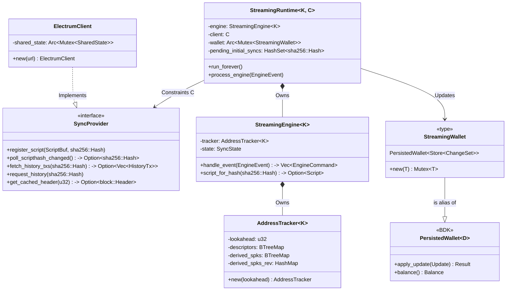

# BDK Electrum Streaming Client PoC 🌊

This repository contains a **Proof of Concept** for adding streaming capabilities to `bdk-electrum`, replacing the traditional polling model with an asynchronous subscription model using the Electrum protocol.

## 🔭 The Big Picture: Custody Agents

While this PoC focuses on BDK and networking internals, it serves as a critical engineering milestone for my venture, **[Custody Agents](https://linkedin.com/company/custodyagents)**.

My long-term roadmap is to build a **Cosigner via Nostr**: a mechanism using decentralized Nostr relays to facilitate encrypted, asynchronous communication of Partially Signed Bitcoin Transactions (PSBTs) between co-signers.

**Target Architecture:**
* **Protocol:** Leverages **Nostr Connect (NIP-46)** to create a Nostr Remote Signer.
* **Resilience:** A serverless architecture that eliminates the "Single Point of Failure" inherent in centralized APIs.
* **Uptime:** Ensures 24/7 operational availability via redundant relay channels for critical transaction signing.

**Why this PoC matters:**
Mastering **Async Rust** and **Streaming Architectures** (via this Electrum implementation) is the direct prerequisite for implementing the event-driven subscription model required by Nostr relays.

## 🧭 Project Context

This project is part of the **Bitcoin Dev Launchpad Residency** from [Vinteum](https://vinteum.org/3-years-EN). It represents the "Production Phase" of my study on Bitcoin Wallets.

* **Phase 1 ([Rust Bitcoin Wallet Evolution](https://github.com/rafaelturon/rust-bitcoin-wallet-evolution)):** Bare-metal wallet implementation (Manual UTXO management, SegWit v0, byte-level transaction construction). *Kept private to respect course integrity.*
* **Phase 2 ([BDK Electrum Streaming Client Poc (see journal)](JOURNAL.md)):** Async networking and integration with the Bitcoin Dev Kit (BDK) ecosystem.

**Goal:**
Enable real-time balance updates and transaction notifications for BDK-based wallets by implementing the `blockchain.scripthash.subscribe` method from the Electrum protocol.

## 🏗️ Architecture TO-BE

## 📋 Next Activities

The upcoming execution steps are divided across different repositories:

### 1. This Repository (`bdk-electrum-streaming-poc`)
* **Documentation & Review:** Update `JOURNAL.md` documenting the prior art discovered to reframe issues (e.g., `create_single()` opt-in and intentional `TxUpdate` temporal context).
* **Community Outreach:** Post on the BDK Discord acknowledging PR #1390, referencing the Wizardsardine audit (Q4 2024), and sharing our streaming PoC and findings.
* **Coordination Hold:** Wait for feedback from the maintainers prior to submitting any PRs to ensure alignment.

### 2. Upstream BDK (`bitcoindevkit/bdk` & `bitcoindevkit/bdk_wallet`)
* **Documentation Issue (bdk_wallet):** File an issue to document `TxUpdate` temporal context requirements (reinforcing the Wizardsardine audit recommendation with real-world developer evidence).
* **Architecture Discussion (bdk):** Open a discussion regarding "Streaming/push-based chain sources: interest and coordination", referencing issue #527 and evanlinjin's experiment, before investing further in a standalone crate.

### 3. Book of BDK (`bitcoindevkit/book-of-bdk`)
* **Cookbook Issue:** Propose a new "Building a Custom Chain Source" cookbook page that highlights how to handle temporal context requirements, lookahead alignment, and the `seen_ats` `BTreeSet` format.

## 🤖 Development Protocol

To maximize learning and technical mastery, I have established a strict **"No-AI Protocol"** for this repository:

1.  **Core Logic (Rust):** Strict **No-AI** policy. All async networking, `tokio` runtime management, and BDK integration logic are hand-written to ensure deep understanding of the underlying mechanics.
2.  **Documentation:** AI tools are used to assist with drafting documentation (like this README) and the Process Journal to ensure clarity and professional English.
3.  **Boilerplate:** AI is permitted for generating CI/CD configurations and generic boilerplate code.

## 📚 Resources

* [Bitcoin Dev Kit (BDK)](https://bitcoindevkit.org/)
* [Electrum Protocol Specification](https://electrumx.readthedocs.io/en/latest/protocol-methods.html)
* [NIP-46: Nostr Connect](https://github.com/nostr-protocol/nips/blob/master/46.md)

---
*Maintained by Rafael Turon*